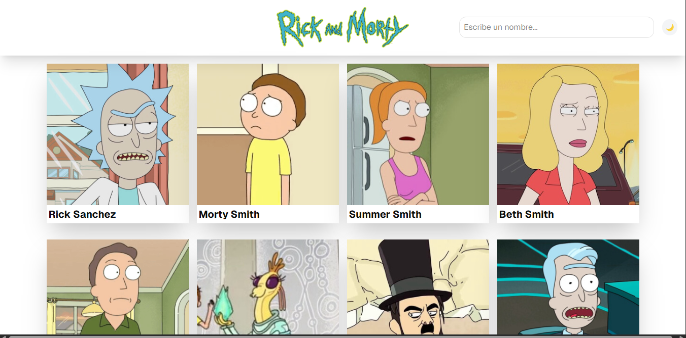

# 🛸 Rick and Morty Character Explorer

Aplicación web para explorar personajes de Rick and Morty consumiendo la [Rick and Morty API](https://rickandmortyapi.com/).

## 🚀 Demo

[Ver demo en vivo](https://rick-and-morty-app-26.netlify.app/)

## ✨ Características

- 🔍 Búsqueda de personajes por nombre
- 📄 Paginación dinámica
- ⚡ Manejo de estados de carga y errores
- 📱 Diseño responsivo
- 🎨 Interfaz limpia con Tailwind CSS

## 🛠️ Stack Tecnológico

- React 18
- TypeScript
- React Router v6
- Tailwind CSS
- Vite
- Rick and Morty API

## 📦 Instalación

```bash
git clone https://github.com/tu-usuario/rick-and-morty-app.git
cd rick-and-morty-app
npm install
npm run dev
```

## 🌐 Despliegue

Desplegado en Netlify con CI/CD automático.

## 📸 Screenshots

<div classname="center">
  
</div>

## 🎯 Aprendizajes

- Consumo de APIs REST
- Manejo de URL search params con React Router
- Custom hooks para lógica reutilizable
- Manejo de errores y estados de carga
- TypeScript para type safety

## 👤 Autor

Jesus Villalobos 
